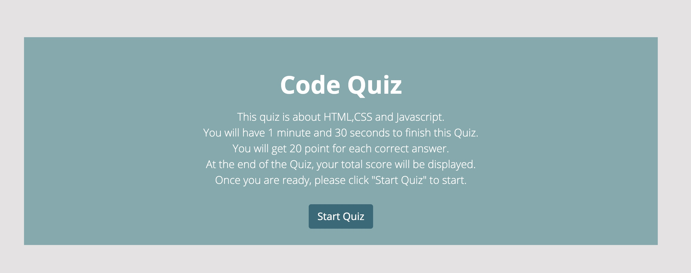
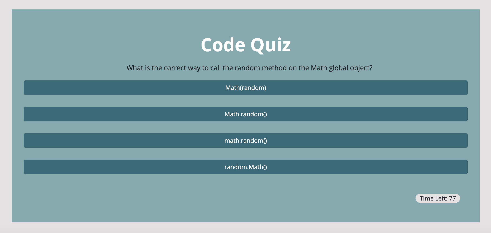

# Code Quiz Web App

## User Story

AS A coding boot camp student
I WANT to take a timed quiz on HTML, CSS and JavaScript fundamentals that stores high scores
SO THAT I can gauge my progress compared to my peers

## Description

This is a timed quiz with multiple choices.
When users click the "start quiz" button, the quiz will start.
There are five questions in total and they have 90 seconds to finish it.
When the time is up or all the questions have been finished.
users can save their initials and scores.
Theirs scores will be displayed at the highscores page.

## Screenshots

The following image shows this Code Quiz Application's appearance and functionality:

## Links

* The URLs of the deployed website: https://mengyue-z.github.io/Code-quiz-app/

* The URLs of the GitHub repositories: https://github.com/mengyue-z/Code-quiz-app